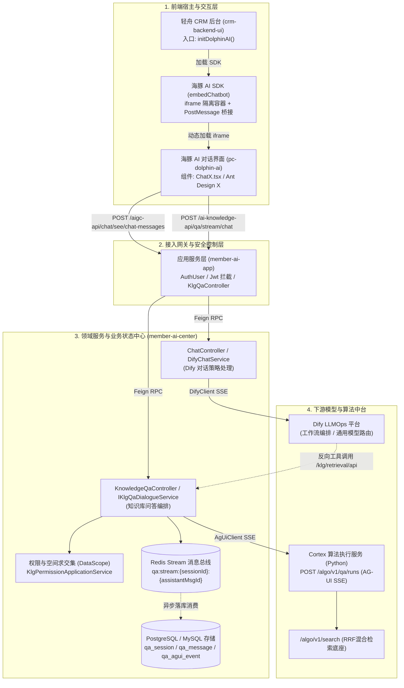

# 🐬 海豚AI与知识库体系全景总览

> 本文档梳理滔搏企业内部以 **海豚AI（Dolphin AI）** 为核心的对话与知识库问答系统。系统以 `member-ai-center` 为领域中枢，串联前端轻舟 CRM、Dify 大模型工作流及 Cortex 算法引擎。

---

## 一、 业务背景与架构定位

随着企业知识沉淀与业务精细化运营，系统需要承载两类典型 AI 交互场景：
1. **智能体通用对话（Dify 主导）**：面向运营人员和员工的多轮助理对话、工作流触发、特定场景 Prompt 编排。
2. **专业企业知识库问答（Cortex 主导）**：面向商品、导购、业务规章的精确检索，支持复杂图文切片、结构化表格、多步推理（Reasoning）与证据回溯。

这两套能力在前端聚合为一个统一的浮动气泡助手——**海豚 AI（Dolphin AI）**。

---

## 二、 五大核心工程矩阵与分工

| 工程名称 | 代码语言 / 框架 | 架构定位 | 核心职责 | 仓库地址 / 本地路径 |
| :--- | :--- | :--- | :--- | :--- |
| **`crm-backend-ui`** | Vue 2/3 + Element | 业务系统前端宿主 | 轻舟 CRM 管理后台，加载海豚 AI SDK 悬浮气泡挂载入口 | `member/backend/ui/crm-backend-ui` `~/Developer/work/topsports/crm-backend-ui` |
| **`pc-dolphin-ai`** | Next.js 14 + React + Ant Design X | AI 对话前端交互应用 | 独立 Chatbot 前端，实现多会话、流式渲染、语音转写、Markdown/Latex 解析 | `member/fe/web/pc/pc-dolphin-ai` `~/Developer/work/topsports/pc-dolphin-ai` |
| **`member-ai-app`** | Java 8 + Spring Boot + WebFlux | 应用层 / API 安全网关 | 鉴权认证（JWT/Token）、参数校验、接口包装暴露给外部/前端 | `member/aigc/member-ai-app` `~/Developer/work/topsports/member-ai-app` |
| **`member-ai-center`** | Java 8 + DDD 分层 + Spring Boot | 核心领域服务中枢 | 业务状态真相源（SSOT）、Dify 客户端流式转换、知识库权限（DataScope）计算、Redis Stream 消息总线与持久化 | `member/aigc/member-ai-center` `~/Developer/work/topsports/member-ai-center` |
| **`cortex`** | Python 3.11 + FastAPI + Uv | 算法与检索执行引擎 | 商品知识图谱语义底座、向量化与 BM25/RRF 混合检索、AG-UI 事件生成、Agent 上下文工程 | `member/aigc/cortex` `~/Developer/work/topsports/cortex` |

---

## 三、 系统全链路架构拓扑

---

## 四、 两条核心链路速览

### 1. 链路一：Dify 对话流程（通用大模型智能体）
* **传输协议**：Dify 原生 SSE 协议封装为统一的 `ChatStreamResponseDTO`。
* **数据流向**：前端 `ChatX` 发起流式请求 ➔ `member-ai-center` 代理并染色灰度 ➔ 调用私有化 Dify ➔ Dify 吐出流式数据行 ➔ 后端转换事件推送前端 ➔ 前端按增量/整句替换更新消息状态。

### 2. 链路二：知识库问答流程（自研 Cortex 检索与 Agent）
* **传输协议**：**AG-UI 协议（Agent UI Protocol）**。
* **数据流向**：前端传入会话与问题 ➔ 后端计算用户知识库权限交集（DataScope） ➔ 触发 Cortex `/algo/v1/qa/runs` ➔ Cortex 输出标准化 AG-UI SSE 事件（文本增量、推理过程、工具调用步骤） ➔ Java 写入 Redis Stream ➔ 前端订阅 SSE 推送 ➔ 支持刷新后带 `streamMessageId` 精确断线续传。

### 3. 两条链路的交叉点
* **知识库作为 Dify 的 Tool/Plugin**：Dify 在运行复杂工作流时，可通过配置插件调用 `member-ai-center` 提供的 `/klg/retrieval/api/knowledge/retrieval` 接口。
* **共享权限底座**：无论是 Dify 反调还是 Cortex 独立问答，统一在 Java 层进行知识库空间 `DataScope` 权限收敛，规避越权访问。