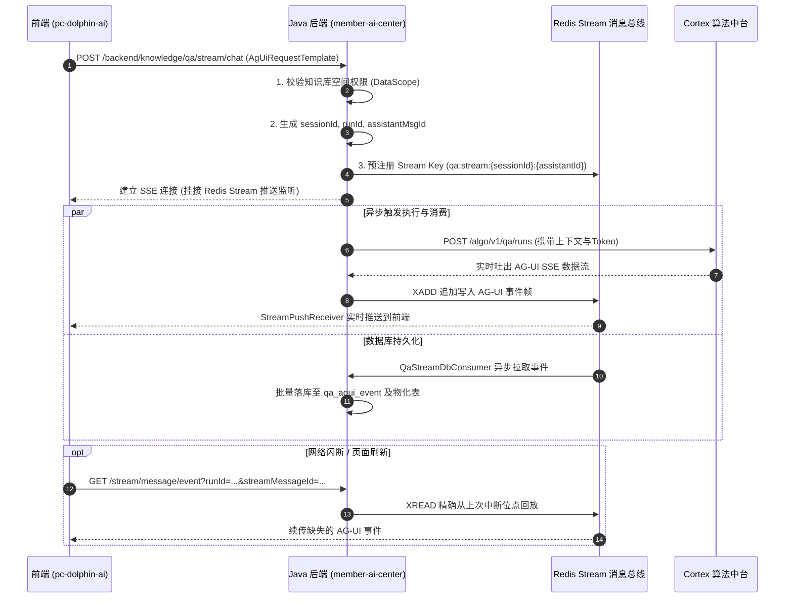

# 📚 知识库问答流与 AG-UI 协议规范

> 本文档详细拆解自研知识库 QA 链路的核心协议——**AG-UI 协议（Agent UI Protocol）**，以及基于 Redis Stream 的异步落库与断线续传高可靠架构。

---

## 一、 协议全名与设计背景

### 1. 协议正名
口语中常说的 **“AI GI 协议”**，其正式名称为 **AG-UI（Agent UI Protocol）**。
在 `member-ai-center` 与 `cortex` 中，该协议被作为智能体与前端交互的标准契约：
* **核心目标**：解耦前端 UI 渲染与后端算法模型。前端无需关心底层使用了哪款 LLM、微调模型或检索算法，仅按标准事件树渲染。
* **统一管理**：标准化生命周期（Run）、思考链（Reasoning）、工具链轨迹（Tool Call）、引用片段（References）及富媒体附件。

### 2. 核心设计原则（三方硬边界）
根据 `cortex` 规范设计文档 [`qa-agui-java-frontend-design.md`](file:///Users/zjy/Developer/work/topsports/cortex/docs/superpowers/specs/2026-04-27-qa-agui-java-frontend-design.md)：
* **前端**：只连接 Java 后端，按 AG-UI 事件类型更新 UI，不直连 Cortex。
* **Java（`member-ai-center`）**：**业务状态唯一真相源（SSOT）**。负责鉴权、用户数据范围（DataScope）计算、分配 Run/Message ID、消费并落库 AG-UI 事件、提供重连回放。
* **Cortex（算法端）**：**纯算法执行器**。不持有业务数据库，只通过 Context Rollout 接口向 Java 请求上下文原料，输出标准化 AG-UI 事件流。

---

## 二、 交互时序与架构拓扑



---

## 三、 请求报文规范（`AgUiRequestTemplate`）

接口支持新提问、编辑重提和重新生成，由 `askType` 进行语义区分：

* **接口路径**：`POST /backend/knowledge/qa/stream/chat`（支持旧版兼容路由 `/ai-knowledge-api/qa/see/chat/completion`）
* **Content-Type**：`application/json`
* **Produce**：`text/event-stream`

### 请求体示例（JSON）
```json
{
  "threadId": "sess_260914_abc123",
  "runId": "run_01j7abc890",
  "messages": [
    {
      "id": "msg-user-001",
      "role": "user",
      "content": "这款跑步鞋的主要缓震科技是什么？适不适合大体重跑者？",
      "sessionId": "sess_260914_abc123",
      "askType": 1,
      "attachments": [
        {
          "fileName": "商品宣传单.png",
          "fileType": "image",
          "fileUrl": "https://member-oss-cdn.topsports.com.cn/img/shoe.png"
        }
      ]
    }
  ],
  "tools": [],
  "context": [],
  "forwardedProps": {
    "agentId": "ca972ab0-6396-4d13-a8f3-00e2e9cbfabd"
  }
}
```

> **参数说明**：
> * `askType`：`1`-新提问，`2`-编辑重提（需带 `originalQuestionId`），`3`-重新生成回答（需带 `parentId`）。

---

## 四、 AG-UI 核心事件流报文规范

AG-UI 在传输层使用标准 SSE 格式：`id: {序号}
data: {JSON}

`。`data` 体内严格遵守大写事件类型。

### 1. 核心事件类型对照表
| 事件类型（`type`） | 说明 | 关键载荷字段 |
| :--- | :--- | :--- |
| **`RUN_STARTED`** | 本次运行生命周期开始 | `runId`, `threadId`, `timestamp` |
| **`REASONING_MESSAGE_CONTENT`** | 深度思考（Thinking）过程增量 | `messageId`, `delta` |
| **`TEXT_MESSAGE_CONTENT`** | 正式回答文本增量 | `messageId`, `delta` |
| **`TOOL_CALL_START`** | 触发工具调用（如检索知识库、查商品） | `toolCallId`, `toolCallName` |
| **`TOOL_CALL_ARGS`** | 工具入参流式拼装 | `toolCallId`, `delta` |
| **`TOOL_CALL_RESULT`** | 工具执行结果回填（引用材料） | `toolCallId`, `content` |
| **`RUN_FINISHED`** | 运行正常结束终态 | `runId`, `usage` (Token开销) |
| **`RUN_ERROR`** | 异常终态（权限不足、超时、算法报错） | `code`, `message` |
| **`CUSTOM_USER_CANCELLED`** | 用户主动点击停止生成 | `runId` |

### 2. 标准报文样例序列

```text
id: 1
data: {"type":"RUN_STARTED","runId":"run_01j7abc890","threadId":"sess_260914_abc123","timestamp":1726300100000}

id: 2
data: {"type":"REASONING_MESSAGE_CONTENT","messageId":"msg-asst-001","delta":"用户询问鞋款缓震科技及大体重适配性，需要调用知识库检索商品参数。"}

id: 3
data: {"type":"TOOL_CALL_START","toolCallId":"call_retrieval_01","toolCallName":"knowledge_search"}

id: 4
data: {"type":"TOOL_CALL_ARGS","toolCallId":"call_retrieval_01","delta":"{"query":"缓震科技 适配体重"}"}

id: 5
data: {"type":"TOOL_CALL_RESULT","toolCallId":"call_retrieval_01","content":"[{"doc_id":"K091","snippet":"采用全掌 ZoomX 泡棉与双重碳板，提供高支撑与强回弹..."}]"}

id: 6
data: {"type":"TEXT_MESSAGE_CONTENT","messageId":"msg-asst-001","delta":"这款跑步鞋采用"}

id: 7
data: {"type":"TEXT_MESSAGE_CONTENT","messageId":"msg-asst-001","delta":"全掌 ZoomX 缓震材料"}

id: 8
data: {"type":"RUN_FINISHED","runId":"run_01j7abc890","timestamp":1726300105000}

```

---

## 五、 高可靠设计：Redis Stream 与断线续传

传统 SSE 若客户端网络抖动或用户刷新页面，流将直接断开并丢失前文。知识库 QA 链路在 [`IKlgQaDialogueService.java#L345-L375`](file:///Users/zjy/Developer/work/topsports/member-ai-center/member-ai-service/src/main/java/com/topsports/member/ai/service/backend/knowledge/qa/dialogua/IKlgQaDialogueService.java#L345-L375) 中引入了 **Redis Stream 解耦层**：

1. **唯一 Stream Key**：
   `streamKey = qa:stream:{sessionId}:{assistantMsgId}`
   保证每个 AI 助手的单条回复拥有专属消息流通道。
2. **解耦传输与持久化**：
   * **推送通道**：`streamPushReceiver` 监听该 Stream 并输出响应式 `Flux<String>` 给 HTTP SSE 客户端。
   * **异步落库**：`qaStreamDbConsumer` 独立消费 Stream 批量插入 `qa_agui_event` 数据库，不阻塞 SSE 推送。
3. **断线续传接口**：
   * 接口：`GET /backend/knowledge/qa/stream/message/event`
   * 参数：`runId`, `userId`, `streamMessageId`
   * 客户端重连时，把上次收到的最后一条 Redis Stream Message ID 传入，服务端自动从该偏移量继续向后读，实现真正的**无感无损重连**。