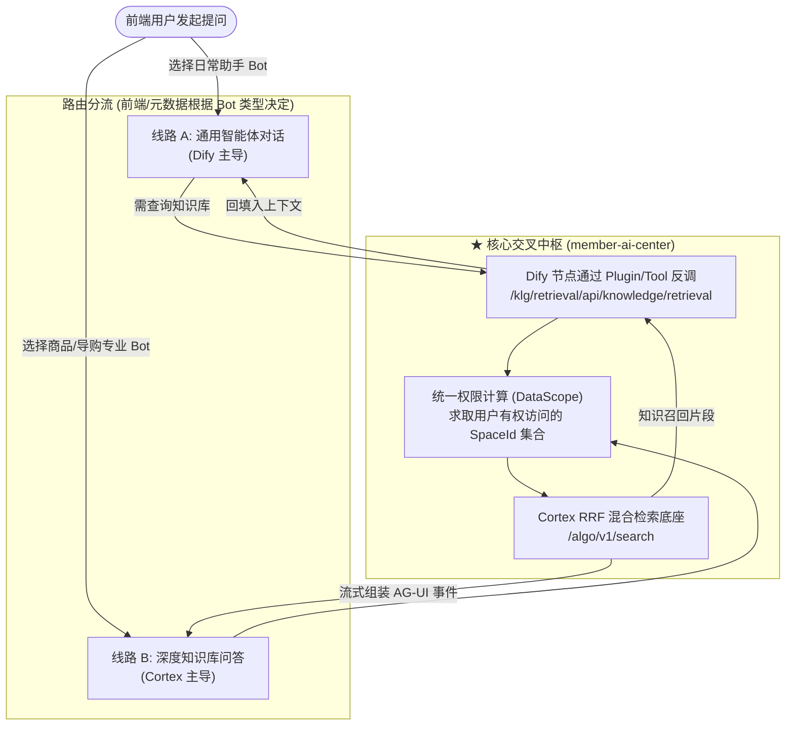

# 🔀 双链路交叉机制与架构对比

> 本文档深入剖析为什么 Dify 对话流与知识库问答流“不是两条平行的线路”，揭示它们在业务、权限、工具调用上的深度交叉融合，并对两套协议做出横向技术对比。

---

## 一、 核心交叉点：两条链路为何深度交织？

在很多系统中，对话机器人与知识库检索往往是完全独立的两个子系统。但在滔搏海豚 AI 体系中，二者在底层深度咬合：

### 1. 交叉场景一：Dify 将自研知识库作为 Tool 反向调用
* **背景**：Dify 作为工作流编排平台，具备优秀的 Prompt 调试、变量抽取和条件分支能力；但 Dify 原生知识库对百丽/滔搏复杂的组织权限架构、商品 SKU 结构化表格、多层级文件夹隔离支持不足。
* **实现机制**：
  * 通过私有化插件 [`dolphin-knowledge-agent-plugin`](file:///Users/zjy/Developer/work/topsports/member-ai-center)，Dify 在执行工作流节点时，通过 HTTP 回调 `member-ai-center` 的 [`KlgRetrievalApiController.java`](file:///Users/zjy/Developer/work/topsports/member-ai-center/member-ai-controller/src/main/java/com/topsports/member/ai/controller/backend/knowledge/KlgRetrievalApiController.java) 接口：
    * `POST /klg/retrieval/api/knowledge/retrieval`（单次知识检索）
    * `POST /klg/retrieval/api/agent/run`（运行知识库专有子智能体）
  * `member-ai-center` 收到后，执行空间权限过滤，下发给 `cortex` 完成 BM25 + 向量检索，并将结果喂回给 Dify。
* **结论**：**Dify 的对话链路在执行过程中，直接内嵌调用了知识库的检索流水线。**

### 2. 交叉场景二：统一的权限管控底座（`DataScope`）
* 企业内部存在严格的数据可见范围（如大区权限、品牌权限、特定资料库可见性）。
* 无论请求是从 **Dify 节点** 反调过来，还是从 **前端知识库原生页面** 传入，`member-ai-center` 都在 [`KlgRetrievalApplicationServiceImpl.java`](file:///Users/zjy/Developer/work/topsports/member-ai-center/member-ai-service/src/main/java/com/topsports/member/ai/service/backend/knowledge/retrieval/KlgRetrievalApplicationServiceImpl.java) 中通过 `buildRetrievalDataScope` 计算用户有权的 `visibleSpaceIds`。
* **结论**：**两者共享同一套权限求交集算法与元数据真相源。**

---

## 二、 两套协议的深度技术对比

| 对比维度 | Dify 对话流协议 | 知识库 AG-UI 协议 |
| :--- | :--- | :--- |
| **设计哲学** | **面向最终文本呈现（Content-oriented）** | **面向运行时状态机与轨迹（Action/State-oriented）** |
| **事件粒度** | 粗粒度（`message`, `message_replace`, `chat_notice`） | 细粒度（`RUN_*`, `REASONING_*`, `TOOL_CALL_*`, `TEXT_*`） |
| **思考链支持** | 通常混合在 answer 或私有 event 中 | 原生支持 `REASONING_MESSAGE_CONTENT`，前端独立折叠框展示 |
| **工具调用轨迹** | 前端不易呈现多步执行中间态 | 完整包含 Start、Args、Result 三段式可视化轨迹 |
| **可靠性保证** | 依赖单个 HTTP 连接长连接，断流后需重新提问 | **依托 Redis Stream 消息总线，支持基于 Sequence/ID 精确断线续传** |
| **数据持久化** | 响应成功后整体保存整条会话记录 | 每一个 AG-UI 事件实时追加落库（`qa_agui_event`），异步维护物化视图 |
| **适用业务场景** | 通用问答、日常运营助手、单步或轻量工作流 | 商品智能语义检索、深度研究分析、长文档/表格专业问答 |

---

## 三、 排查定位与日常调试实战

在日常维护或接手该系统时，排查两条链路的定位手段如下：

### 1. 灰度与日志链路串联（`grayTraceId` / `traceparent`）
* **Dify 链路**：检查 HTTP 请求头中的 `x-request-env-flag`。`member-ai-center` 会将当前请求的 `traceId` 注入到 Dify 的请求 URL 中：`apiUrl + "?grayTraceId=" + traceId`。排查时可直接根据全局 TraceId 在前后端和 Dify 日志中对齐。
* **Cortex 链路**：`member-ai-center` 开启了 OpenTelemetry 手工根 Span（`OtelTraceHelper.SPAN_QA_RUN`）。在调用 Cortex 前，通过 W3C Trace Context 规范向 Cortex 注入 `traceparent` 请求头。

### 2. Redis Stream 状态与断流排查
若知识库问答出现前端断流或卡在 loading：
* 检查 Redis Stream Key 是否创建成功：`qa:stream:{sessionId}:{assistantMsgId}`；
* 检查活跃集合 `qa:stream:active_set` 中是否存在该 Stream Key；
* 通过 Redis CLI 命令 `XREVRANGE qa:stream:{key} + - COUNT 5` 查看 Cortex 是否正常写入事件；
* 观察末尾事件是否包含终态类型（`RUN_FINISHED` 或 `RUN_ERROR`）。若缺失终态，前端状态机会一直处于 `updating`，需关注超时熔断兜底逻辑。

### 3. 会话重置与失效
* 在 `DifyChatService.java#L148-L154` 中，系统会调用 Dify 的 `getMessages` 校验前端传上来的 `conversationId` 是否真实有效。如果会话在 Dify 侧已被清理或过期，Java 端会自动执行 `resetConversationId()` 重新开启新会话，避免抛错。